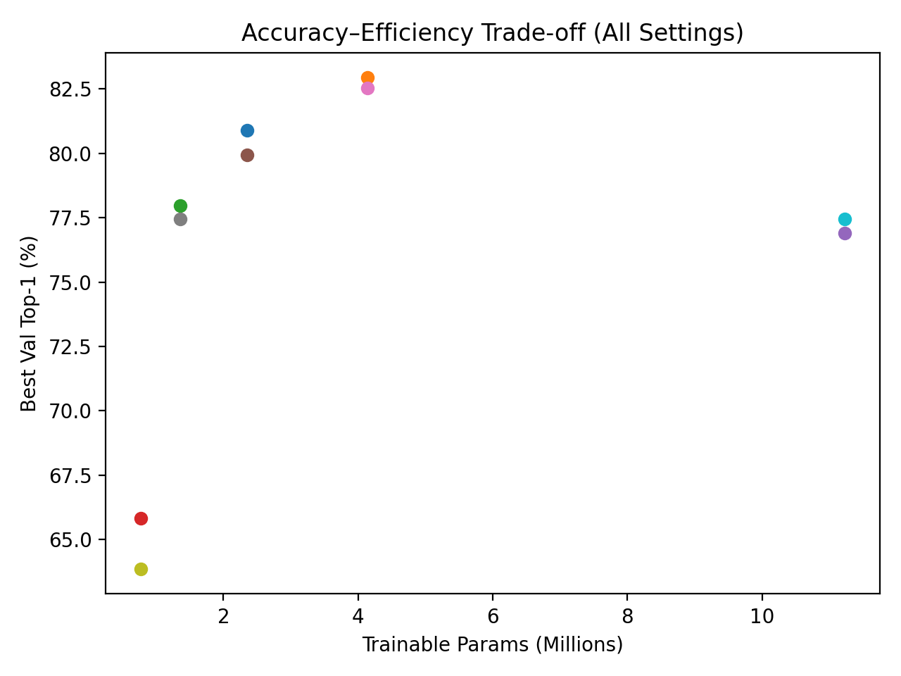
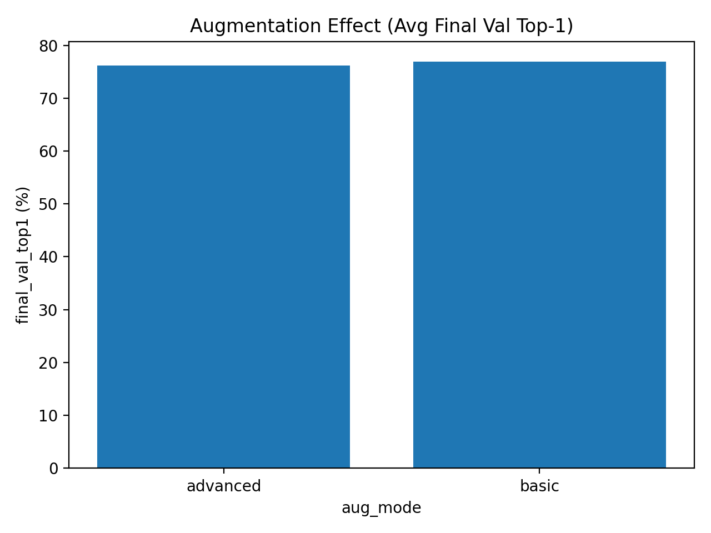
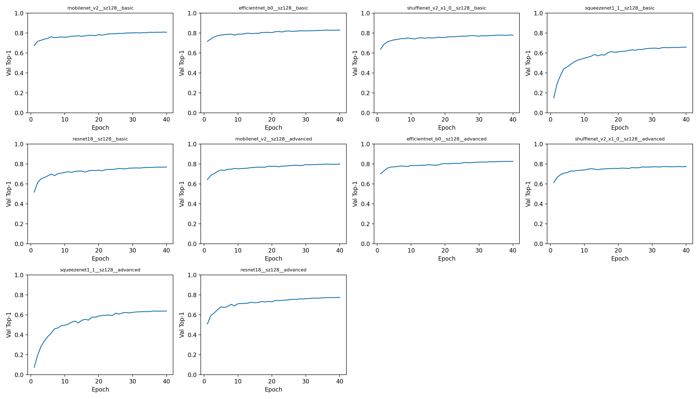
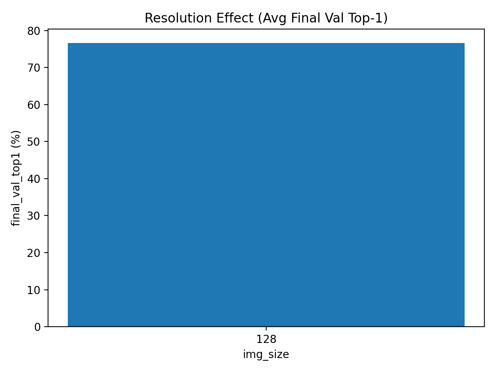

# Rethinking Efficiency: A Comparative Study of Lightweight CNN Architectures for Image Classification

[](https://www.python.org/)
[](https://pytorch.org/)
[](https://pytorch.org/vision/stable/models.html)
[](https://www.cs.toronto.edu/~kriz/cifar.html)
[](#)
[](LICENSE)
[](https://doi.org/10.64878/jistics.v2i1.167)

Official implementation and experimental outputs for the paper:

> **Rethinking Efficiency: A Comparative Study of Lightweight CNN Architectures for Image Classification**  
> Mochamad Rizal Fauzan, Naufal Nadhif Rabbani Iskandar, and Rafi Zahran Fauzi  
> *Journal of Intelligent Systems, Technology, and Informatics (JISTICS)*, Vol. 2, No. 1, pp. 13--21, March 2026  
> DOI: `10.64878/jistics.v2i1.167`

This repository provides a reproducible benchmark for comparing lightweight convolutional neural network architectures on CIFAR-100 under a unified training and evaluation protocol. The benchmark evaluates five CNN backbones: **MobileNetV2**, **EfficientNet-B0**, **ShuffleNetV2 x1.0**, **SqueezeNet1.1**, and **ResNet-18**.

---

## Table of Contents

- [Overview](#overview)
- [Contributions](#contributions)
- [Benchmark Design](#benchmark-design)
- [Key Results](#key-results)
- [Detailed Experimental Results](#detailed-experimental-results)
- [Figures](#figures)
- [Evaluation Metrics](#evaluation-metrics)
- [Repository Structure](#repository-structure)
- [Installation](#installation)
- [Usage](#usage)
- [Reproducibility Notes](#reproducibility-notes)
- [What Is Included and Excluded](#what-is-included-and-excluded)
- [Citation](#citation)
- [License](#license)
- [Contact](#contact)

---

## Overview

Lightweight CNNs are widely used for image classification in resource-constrained environments, including edge computing, embedded vision, and real-time intelligent systems. However, comparing lightweight architectures is often difficult because studies may use different input resolutions, training schedules, augmentation strategies, optimizers, or evaluation hardware.

This repository addresses that issue by using a unified CIFAR-100 benchmark pipeline. All evaluated models are trained under the same experimental setting, resized to the same input resolution, optimized using the same training protocol, and evaluated using the same accuracy and efficiency metrics.

The main objective is not only to identify the most accurate model, but also to analyze the trade-off between:

- classification accuracy;
- parameter count;
- inference latency;
- training time;
- augmentation sensitivity.

---

## Contributions

This repository supports the paper through the following reproducible components:

1. a unified PyTorch training pipeline for five lightweight CNN architectures;
2. controlled CIFAR-100 evaluation at 128 x 128 input resolution;
3. comparison between basic and advanced augmentation strategies;
4. reporting of Top-1 accuracy, Top-5 accuracy, parameter count, latency, and training time;
5. released experimental outputs, aggregate result tables, and visualization figures.

---

## Benchmark Design

### Evaluated Models

| Model | Role in Benchmark | Main Characteristic |
|---|---|---|
| EfficientNet-B0 | Accuracy-oriented lightweight CNN | Compound scaling with strong accuracy-efficiency balance |
| MobileNetV2 | Mobile CNN baseline | Inverted residual blocks and linear bottlenecks |
| ShuffleNetV2 x1.0 | Efficient mobile CNN | Channel shuffle and low-computation design |
| SqueezeNet1.1 | Extremely compact CNN | Very small parameter footprint |
| ResNet-18 | Compact residual baseline | Residual learning with simple convolutional blocks |

### Dataset

| Item | Configuration |
|---|---|
| Dataset | CIFAR-100 |
| Number of classes | 100 |
| Training images | 50,000 |
| Test images | 10,000 |
| Original image size | 32 x 32 |
| Benchmark input size | 128 x 128 |
| Normalization | ImageNet mean and standard deviation |

### Training Configuration

| Hyperparameter | Value |
|---|---|
| Epochs | 40 |
| Batch size | 128 |
| Optimizer | AdamW |
| Learning rate | 0.001 |
| Weight decay | 0.0001 |
| Scheduler | Cosine annealing |
| Mixed precision | Enabled with AMP |
| Gradient clipping | 1.0 |
| Pretrained weights | ImageNet-pretrained backbones |
| Random seed | 42 |
| Input resolution | 128 x 128 |

### Augmentation Strategies

| Strategy | Transform Pipeline |
|---|---|
| Basic | Resize -> RandomResizedCrop -> RandomHorizontalFlip -> Normalize |
| Advanced | Resize -> RandomResizedCrop -> RandomHorizontalFlip -> ColorJitter -> RandomRotation -> Normalize |

---

## Key Results

The following table reports model-level aggregate results averaged across the evaluated augmentation modes.

| Model | Params (M) | Top-1 (%) | Top-5 (%) | Latency (ms) | Train Time (s) |
|---|---:|---:|---:|---:|---:|
| EfficientNet-B0 | 4.14 | 82.75 | 96.46 | 5.46 | 1046.55 |
| MobileNetV2 | 2.35 | 80.42 | 95.82 | 3.55 | 810.95 |
| ShuffleNetV2 x1.0 | 1.36 | 77.71 | 95.14 | 4.35 | 629.29 |
| ResNet-18 | 11.23 | 77.18 | 94.03 | 1.68 | 721.60 |
| SqueezeNet1.1 | 0.77 | 64.83 | 89.36 | 1.52 | 570.67 |

### Main Findings

- **EfficientNet-B0** achieved the highest average Top-1 accuracy, reaching **82.75%**, while using only **4.14M** trainable parameters.
- **MobileNetV2** provided a strong balance between accuracy and efficiency, reaching **80.42%** average Top-1 accuracy with **2.35M** parameters.
- **SqueezeNet1.1** had the smallest parameter count and fastest inference latency, but showed a large accuracy drop compared with the other architectures.
- **ResNet-18** achieved very low latency, but its accuracy was lower than EfficientNet-B0 and MobileNetV2 despite having more parameters.
- Advanced augmentation did not universally improve accuracy. On average, it reduced Top-1 accuracy compared with the basic augmentation setting.

---

## Detailed Experimental Results

### Per-Setting Results

| Model | Augmentation | Params (M) | Top-1 (%) | Top-5 (%) | Latency (ms) | Train Time (s) |
|---|---|---:|---:|---:|---:|---:|
| MobileNetV2 | Basic | 2.35 | 80.89 | 96.00 | 3.56 | 771.55 |
| EfficientNet-B0 | Basic | 4.14 | 82.96 | 96.42 | 5.43 | 1041.75 |
| ShuffleNetV2 x1.0 | Basic | 1.36 | 77.96 | 95.20 | 4.32 | 470.81 |
| SqueezeNet1.1 | Basic | 0.77 | 65.82 | 90.00 | 1.51 | 368.07 |
| ResNet-18 | Basic | 11.23 | 76.90 | 94.13 | 1.70 | 631.73 |
| MobileNetV2 | Advanced | 2.35 | 79.94 | 95.63 | 3.55 | 850.35 |
| EfficientNet-B0 | Advanced | 4.14 | 82.53 | 96.49 | 5.49 | 1051.35 |
| ShuffleNetV2 x1.0 | Advanced | 1.36 | 77.45 | 95.08 | 4.38 | 787.76 |
| SqueezeNet1.1 | Advanced | 0.77 | 63.84 | 88.72 | 1.53 | 773.27 |
| ResNet-18 | Advanced | 11.23 | 77.46 | 93.93 | 1.67 | 811.48 |

### Augmentation Effect

| Augmentation | Average Top-1 (%) | Average Top-5 (%) |
|---|---:|---:|
| Basic | 76.91 | 94.35 |
| Advanced | 76.24 | 93.97 |
| Difference | -0.66 | -0.38 |

The result suggests that stronger augmentation does not automatically improve lightweight CNN performance on the evaluated CIFAR-100 configuration. While advanced augmentation may improve robustness in some cases, it can also introduce additional variability that reduces final validation accuracy, especially for smaller-capacity architectures.

---

## Figures

### Accuracy-Efficiency Trade-off



### Augmentation Effect



### Training Convergence



### Resolution Effect



---

## Evaluation Metrics

This section provides the main evaluation formulas using GitHub-safe Markdown equations.

### Cross-Entropy Loss

For a classification problem with $C$ classes, the cross-entropy loss is defined as:

$$\mathcal{L}_{CE} = -\sum_{c=1}^{C} y_c \log(\hat{p}_c)$$

where $y_c$ is the one-hot ground-truth label for class $c$, and $\hat{p}_c$ is the predicted probability for class $c$.

### Top-k Accuracy

Top-k accuracy measures whether the ground-truth label appears among the top-k predicted classes:

$$\mathrm{TopK} = \frac{1}{N}\sum_{i=1}^{N}\mathbf{1}(y_i \in \mathcal{P}_{i,k})\times 100$$

where $N$ is the number of test samples, $y_i$ is the ground-truth label of sample $i$, and $\mathcal{P}_{i,k}$ is the set of top-k predicted labels for sample $i$.

### Inference Latency

Inference latency is measured as the average inference time per image:

$$\mathrm{Latency}_{ms} = \frac{1}{M}\sum_{m=1}^{M}t_m$$

where $M$ is the number of measured inference iterations and $t_m$ is the inference time of iteration $m$ in milliseconds.

### Parameter Count

The number of trainable parameters is computed as:

$$\mathrm{Params} = \sum_{l=1}^{L}\theta_l$$

where $\theta_l$ denotes the number of trainable parameters in layer $l$, and $L$ is the total number of trainable layers.

### Accuracy per Parameter

A simple accuracy-efficiency indicator can be expressed as:

$$\mathrm{AccParam} = \frac{\mathrm{Top1}}{\mathrm{Params}_{M}}$$

where $\mathrm{Top1}$ is the Top-1 accuracy and $\mathrm{Params}_{M}$ is the number of parameters in millions.

### Augmentation Difference

The effect of advanced augmentation relative to basic augmentation is computed as:

$$\Delta_{aug} = \mathrm{Top1}_{advanced} - \mathrm{Top1}_{basic}$$

A positive value indicates that advanced augmentation improves Top-1 accuracy, while a negative value indicates that it decreases Top-1 accuracy.

---

## Repository Structure

```text
.
├── README.md
├── LICENSE
├── requirements.txt
├── cekspek.py
├── train_cnn_benchmark_grid.py
└── runs/
    └── 20260306_060218/
        ├── results_full.csv
        ├── results_agg_by_model.csv
        ├── results_agg_by_aug.csv
        ├── results_agg_by_resolution.csv
        ├── tradeoff_acc_vs_params.png
        ├── augmentation_effect.png
        ├── convergence_grid.png
        └── resolution_effect.png
```

Generated local outputs may also include configuration files, full metric histories, and model checkpoints depending on the execution settings.

---

## Installation

Clone the repository:

```bash
git clone https://github.com/rizalfanex/lightweight-cnn-benchmark.git
cd lightweight-cnn-benchmark
```

Create a Python environment:

```bash
python -m venv .venv
```

Activate the environment.

For Windows PowerShell:

```powershell
.\.venv\Scripts\Activate.ps1
```

For Linux or macOS:

```bash
source .venv/bin/activate
```

Install dependencies:

```bash
python -m pip install --upgrade pip
python -m pip install -r requirements.txt
```

If the dependency file is empty or incomplete, install the core dependencies manually:

```bash
python -m pip install torch torchvision matplotlib numpy
```

For CUDA-enabled execution, install the PyTorch build that matches your CUDA version using the official PyTorch installation command.

---

## Usage

### Check Hardware and Environment

```bash
python cekspek.py
```

### Run the Full Benchmark

```bash
python train_cnn_benchmark_grid.py \
    --epochs 40 \
    --batch 128 \
    --lr 0.001 \
    --img-sizes 128 \
    --aug-modes basic advanced \
    --models mobilenet_v2 efficientnet_b0 shufflenet_v2_x1_0 squeezenet1_1 resnet18
```

For Windows PowerShell:

```powershell
python train_cnn_benchmark_grid.py `
    --epochs 40 `
    --batch 128 `
    --lr 0.001 `
    --img-sizes 128 `
    --aug-modes basic advanced `
    --models mobilenet_v2 efficientnet_b0 shufflenet_v2_x1_0 squeezenet1_1 resnet18
```

### Run a Quick Single-Model Test

```bash
python train_cnn_benchmark_grid.py \
    --epochs 5 \
    --models efficientnet_b0 \
    --img-sizes 128 \
    --aug-modes basic
```

For Windows PowerShell:

```powershell
python train_cnn_benchmark_grid.py `
    --epochs 5 `
    --models efficientnet_b0 `
    --img-sizes 128 `
    --aug-modes basic
```

The CIFAR-100 dataset will be downloaded automatically by torchvision during the first run.

---

## Reproducibility Notes

To reproduce the reported results as closely as possible:

1. use the same random seed, `42`;
2. keep the same input size, `128 x 128`;
3. train for `40` epochs;
4. use the same optimizer, learning rate, and weight decay;
5. use ImageNet-pretrained model weights;
6. evaluate all models under the same augmentation settings;
7. measure latency on the same hardware and with the same synchronization protocol;
8. report the hardware, CUDA version, PyTorch version, and batch configuration when comparing latency.

Small differences may occur because of GPU type, CUDA/cuDNN behavior, PyTorch version, random initialization, and hardware-level timing variation.

---

## What Is Included and Excluded

Included:

- main benchmark training script;
- hardware checking script;
- aggregate result tables;
- per-setting result table;
- visualization figures;
- license file;
- README documentation.

Excluded or intentionally not tracked:

- raw CIFAR-100 dataset files;
- large model checkpoints;
- Python cache files;
- local virtual environments;
- temporary training artifacts.

This keeps the repository lightweight and avoids unnecessary large-file uploads.

---

## Citation

If this repository is useful for your research, please cite the paper:

```bibtex
@article{fauzan2026rethinking,
  title   = {Rethinking Efficiency: A Comparative Study of Lightweight CNN Architectures for Image Classification},
  author  = {Fauzan, Mochamad Rizal and Iskandar, Naufal Nadhif Rabbani and Fauzi, Rafi Zahran},
  journal = {Journal of Intelligent Systems, Technology, and Informatics},
  volume  = {2},
  number  = {1},
  pages   = {13--21},
  year    = {2026},
  doi     = {10.64878/jistics.v2i1.167}
}
```

---

## License

This project is released under the MIT License. See [`LICENSE`](LICENSE) for details.

---

## Contact

For questions, issues, or reproducibility discussions, please use the GitHub Issues page of this repository.
